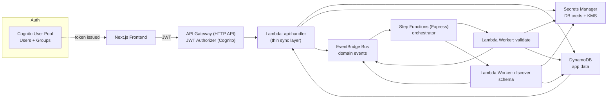

## Architecture diagram (MVP, serverless, event-driven)



---

# Backend Spec Sheet

## 0) Scope

**MVP delivers**

1. Cognito auth (signup/login) and basic RBAC
2. Org/workspace + membership
3. DB connection creation (store credentials securely)
4. Async validate + schema discovery (event-driven)
5. Persist schema results
6. Save user table selections

**Non-goals (MVP)**

* Fine-grained ABAC, row/table-level permissions
* SSO, SCIM
* Multi-region, HA, advanced throttling/WAF
* Full audit trail and compliance posture

---

## 1) Services (AWS)

**Auth**

* Cognito User Pool

  * Groups: `platform_admin`, `user` (default)

**API**

* API Gateway HTTP API

  * JWT Authorizer (Cognito User Pool)
* Lambda `api-handler`

  * Request validation
  * Org/connection CRUD
  * Emits domain events
  * Does not run discovery logic inline

**Eventing**

* EventBridge bus `app-bus`

  * Domain events (connection/job lifecycle, selection saved)

**Orchestration**

* Step Functions Express `connection-workflow`

  * Runs validate/discover steps with retries/backoff

**Workers**

* Lambda `worker-validate`
* Lambda `worker-discover`

**Storage**

* DynamoDB `app-table` (single-table design; on-demand)
* Secrets Manager `conn/<orgId>/<connectionId>` secrets (+ KMS CMK or AWS-managed)

**Observability**

* CloudWatch Logs + Metrics
* (Optional) X-Ray

---

## 2) Data model (single-table DynamoDB)

### Table: `app-table`

**Primary key**

* `PK` (string)
* `SK` (string)

**Common attributes**

* `entityType` (string)
* `createdAt` (ISO string)
* `updatedAt` (ISO string)
* `version` (number)

### 2.1 Entities and keys

#### Org

* `PK = ORG#<orgId>`
* `SK = ORG#<orgId>`
* Attributes:

  * `name` (string)
  * `createdBy` (userId)

#### OrgMembership

* `PK = ORG#<orgId>`
* `SK = MEM#<userId>`
* Attributes:

  * `role` = `org_owner|org_admin|org_member|org_viewer`

**(Optional fast lookup for “my orgs”)** write a second item:

* `PK = USER#<userId>`
* `SK = ORG#<orgId>`
* Attributes:

  * `role`, `orgName`

#### Connection

* `PK = ORG#<orgId>`
* `SK = CONN#<connectionId>`
* Attributes:

  * `name` (string)
  * `provider` (enum: `postgres|mysql|mssql|snowflake|...`)
  * `endpoint` (object)

    * `host` (string)
    * `port` (number)
    * `database` (string|null)
    * `ssl` (boolean|null)
  * `secretArn` (string) **required**
  * `status` (enum)

    * `CREATED|VALIDATION_QUEUED|VALIDATED|DISCOVERY_RUNNING|READY|FAILED`
  * `lastError` (string|null)

#### DiscoveryResult (stored on the connection item OR separate item)

**Option A (simplest): store on Connection**

* `discovery` (object)

  * `discoveredAt`
  * `schemas: [{ schemaName, tables: [{ tableName }] }]`

**Option B (separate item, safer if large)**

* `PK = ORG#<orgId>`
* `SK = DISC#<connectionId>`
* Attributes:

  * `discoveredAt`
  * `schemas` (same as above)
  * (Optional) `s3Uri` if too large

#### Selection

* `PK = ORG#<orgId>`
* `SK = SEL#<connectionId>#<selectionId>`
* Attributes:

  * `connectionId`
  * `selected`:

    * `[{ schemaName: string, tables: string[] }]`
  * `createdBy` (userId)

#### Job

* `PK = ORG#<orgId>`
* `SK = JOB#<jobId>`
* Attributes:

  * `connectionId`
  * `type` = `VALIDATE|DISCOVER`
  * `status` = `QUEUED|RUNNING|SUCCEEDED|FAILED`
  * `error` (string|null)
  * `startedAt`, `finishedAt`

---

## 3) Secrets model (Secrets Manager)

**Secret name pattern**

* `conn/<orgId>/<connectionId>`

**Secret value JSON (example)**

```json
{
  "username": "dbuser",
  "password": "dbpass",
  "optional": {
    "sslMode": "require",
    "warehouse": "..." 
  }
}
```

**Rules**

* API layer writes secret once at connection create/update
* Workers read secret by `secretArn`
* Never log secret payload

---

## 4) Domain events (EventBridge)

Bus: `app-bus`
Source: `app.backend`
Detail contracts (v1):

### Events

* `connection.validation_requested`
* `connection.validated`
* `connection.validation_failed`
* `connection.discovery_requested`
* `connection.discovery_succeeded`
* `connection.discovery_failed`
* `selection.saved`

### Event payload (canonical)

```json
{
  "v": 1,
  "orgId": "…",
  "connectionId": "…",
  "jobId": "…",
  "actorUserId": "…",
  "ts": "2026-02-12T12:34:56.000Z"
}
```

---

## 5) Workflows (Step Functions Express)

### 5.1 Validate workflow

1. Read Connection from DDB
2. Read Secret from Secrets Manager
3. Attempt DB connection (worker-validate)
4. Update:

   * Connection.status = `VALIDATED` or `FAILED`
   * Job.status = `SUCCEEDED` or `FAILED`
5. Emit validated/failed event

### 5.2 Discover workflow

1. Ensure validated (if not, fail or chain validate first — choose one; MVP: require validated)
2. Read Secret
3. Query schema/table list (worker-discover)
4. Persist discovery result
5. Update Connection.status = `READY`
6. Emit discovery_succeeded/failed event

---

## 6) API Routes (REST, `/v1`)

**Auth**: Bearer JWT. API Gateway authorizer validates JWT.
**Org authorization**: all org-scoped routes require membership check in DDB.

### 6.1 User

#### `GET /v1/me`

Returns caller identity + org memberships.

---

### 6.2 Orgs

#### `POST /v1/orgs`

Create org, create membership = `org_owner`.

Body:

```json
{ "name": "Acme" }
```

#### `GET /v1/orgs`

List orgs for caller.

#### `GET /v1/orgs/{orgId}`

Get org (must be member).

#### `GET /v1/orgs/{orgId}/members`

List members (org_admin+).

#### `POST /v1/orgs/{orgId}/members`

Add member (org_admin+).

Body:

```json
{ "email": "a@b.com", "role": "org_member" }
```

MVP note: if user not found, return 404 or create “pending invite” (optional).

---

### 6.3 Connections

#### `POST /v1/orgs/{orgId}/connections`

Create connection metadata + write secret.

Body (provider-agnostic MVP):

```json
{
  "name": "Prod DB",
  "provider": "postgres",
  "endpoint": { "host": "x", "port": 5432, "database": "appdb", "ssl": true },
  "credentials": { "username": "u", "password": "p" }
}
```

Response:

```json
{ "connectionId": "...", "status": "CREATED" }
```

#### `GET /v1/orgs/{orgId}/connections`

List connections.

#### `GET /v1/orgs/{orgId}/connections/{connectionId}`

Get connection (no secrets returned).

#### `POST /v1/orgs/{orgId}/connections/{connectionId}/validate`

Creates Job(type=VALIDATE), sets status `VALIDATION_QUEUED`, emits `connection.validation_requested`.

Response:

```json
{ "jobId": "...", "status": "QUEUED" }
```

#### `POST /v1/orgs/{orgId}/connections/{connectionId}/discover`

Creates Job(type=DISCOVER), sets status `DISCOVERY_RUNNING`, emits `connection.discovery_requested`.

Response:

```json
{ "jobId": "...", "status": "QUEUED" }
```

#### `GET /v1/orgs/{orgId}/connections/{connectionId}/schemas`

Returns discovery result if present.

Response:

```json
{
  "status": "READY",
  "discoveredAt": "…",
  "schemas": [
    { "schemaName": "public", "tables": [{ "tableName": "users" }, { "tableName": "orders" }] }
  ]
}
```

#### `DELETE /v1/orgs/{orgId}/connections/{connectionId}`

org_admin+. Deletes metadata and secret (or soft-delete; MVP choice: soft-delete to avoid accidental loss).

---

### 6.4 Selections

#### `POST /v1/orgs/{orgId}/connections/{connectionId}/selections`

Save selected tables.

Body:

```json
{
  "selected": [
    { "schemaName": "public", "tables": ["users", "orders"] }
  ]
}
```

Response:

```json
{ "selectionId": "...", "createdAt": "..." }
```

#### `GET /v1/orgs/{orgId}/connections/{connectionId}/selections`

List selections (or return latest; MVP pick one and be consistent).

---

### 6.5 Jobs

#### `GET /v1/orgs/{orgId}/jobs`

List jobs (desc by createdAt).

#### `GET /v1/orgs/{orgId}/jobs/{jobId}`

Return job status + error.

---

## 7) Access control matrix (MVP)

* org_viewer: read org, read connections, read schemas, read selections, read jobs
* org_member: all viewer + create connection + validate/discover + create selection
* org_admin: all member + manage members + delete connection
* org_owner: same as admin (MVP)